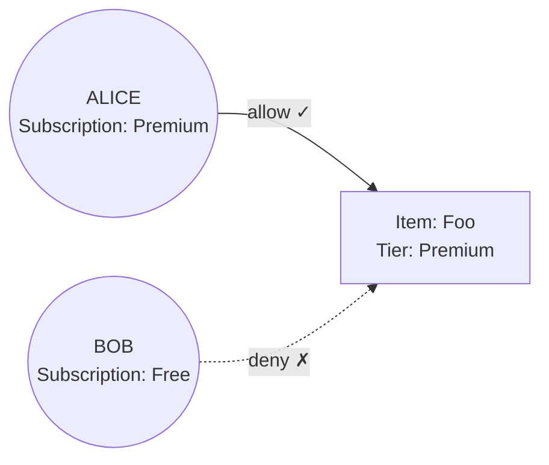

> ## Documentation Index
> Fetch the complete documentation index at: https://www.osohq.com/docs/llms.txt
> Use this file to discover all available pages before exploring further.

# Model Attribute-Based Access Control (ABAC)

> Best practices for modeling attribute-based access control in Oso Cloud.

The ABAC pattern controls access based on resource attributes like status, visibility, or classification. Use ABAC when permissions depend on dynamic properties rather than fixed roles.



**When to use ABAC:**

* Resources have different visibility levels (public, private, confidential)
* Access depends on resource state (draft, published, archived)
* Geographic or time-based restrictions apply
* Complex conditional logic combines multiple attributes

**RBAC vs ABAC:** Use RBAC for stable organizational roles. Use ABAC when access rules change based on resource properties or context.

## Public or private resources

Control access based on resource visibility. Public resources are readable by anyone, private resources require specific permissions.

```polar  theme={null}
actor User { }
resource Repository {
  permissions = ["read"];

  "read" if is_public(resource);
}

test "public repositories" {
  setup {
    is_public(Repository{"anvil"});
  }

  assert allow(User{"alice"}, "read", Repository{"anvil"});
}
```

Ensure your application sets the appropriate attribute when creating resources.

## Common ABAC patterns

Explore these additional attribute-based patterns:

| Pattern                                                               | Description                                                             |
| --------------------------------------------------------------------- | ----------------------------------------------------------------------- |
| **[Entitlements](/develop/policies/patterns/entitlements)**           | Grant access based on subscription tiers or purchased features          |
| **[Time-based access](/develop/policies/patterns/time-based-checks)** | Grant roles and permissions that are time-bounded and can expire        |
| **[Conditional roles](/develop/policies/patterns/conditional-roles)** | Assign roles based on conditions like default roles and feature toggles |

## Next steps

With your ABAC policy defined:

1. [**Add facts**](/develop/facts/overview): Store resource attributes and user context in Oso Cloud
2. [**Make authorization requests**](/develop/enforce/authorize-requests): Check permissions in your application code
3. **Test scenarios**: Verify policies work with different attribute combinations
