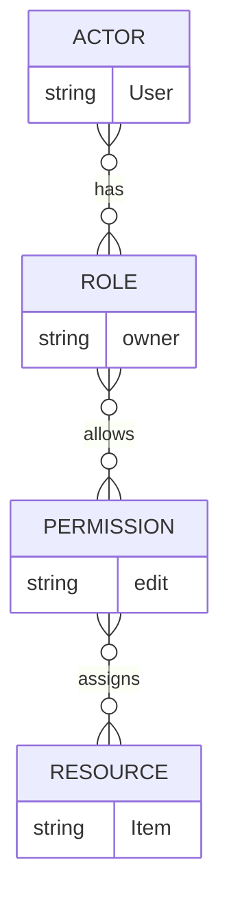

> ## Documentation Index
> Fetch the complete documentation index at: https://www.osohq.com/docs/llms.txt
> Use this file to discover all available pages before exploring further.

# Overview of Polar Language and Syntax

Polar is our authorization language for defining who can do what in your application. This guide covers the core building blocks and syntax you need to write authorization policies.



## Core Building Blocks

### Actor

The "who" in authorization. This is typically users or services making requests.

```polar  theme={null}
actor User { }
```

### Resource

The "what" being protected, usually application resources like documents, projects, or organizations.

```polar  theme={null}
resource Organization { }
resource Document { }
```

### Roles

Roles are named sets of permissions that can be assigned to actors on resources.

```polar  theme={null}
resource Organization {
  # array of unique role names
  roles = ["admin", "member", "viewer"];
}
```

### Permissions

Permissions are specified actions that can be performed on resources. Permissions are assigned to roles.

```polar  theme={null}
resource Organization {
  roles = ["viewer", "member", "admin"];
  # array of unique action names
  permissions = ["read", "update", "delete"];

  # assigns "read" permission to "viewer" role
  "read" if "viewer"
}
```

### Relations

Relations represent connections between resources, like "document belongs to project" or "project belongs to organization."

```polar  theme={null}
resource Document {
  # define as key-value pairs - { relationName: resourceName }
  relations = {
    organization: Organization,
  };
}
```

## Writing Rules

Rules define authorization logic using this syntax:

```polar  theme={null}
actor User {}
resource Organization {
  roles = ["viewer", "member", "admin"];
  permissions = ["read", "update", "delete"];
  # assign permission to role - "permission" if "role"
  "read" if "viewer";
  "update" if "member";
  "delete" if "admin";
  # inherit permissions - "role" if "role"
  "viewer" if "member";
  "member" if "admin";
}
resource Document {
  roles = ["viewer", "admin"];
  permissions = ["read", "edit", "delete"]
  relations = {
    organization: Organization,
    creator: User
  };
  # role assignment via relationship
  role if role on "organization";
  # permission assignment via relationship
  "delete" if "creator" on resource;
  # permission assignment via role on relationship
  "edit" if "member" on "organization";
}
```

This sample policy defines these authorization rules:

* Organization viewers can read organizations
* Organization members can update organizations
* Organization admins can delete organizations
* Organization members inherit all viewer permissions
* Organization admins inherit all member permissions
* Users have a role on documents if they have the same named role on the document's organization
* Document creators can delete a given document
* Organization members can edit documents if the document belongs to their organization

For a comprehensive look at Polar's syntax and capabilities, read our [Polar Reference Docs](/reference/polar/introduction).

## Preview Policy Performance

Once you’ve written or modified a policy, you can use the Policy Preview CLI command to evaluate how those changes affect query performance before deploying to production.
Policy Preview runs authorization queries against both your current and candidate policies and outputs a side-by-side performance comparison.

This is useful when:

* Iterating on rules that might change query complexity or evaluation time
* Validating large refactors or new relationships in Polar logic
* Enforcing performance guardrails in CI pipelines using regression thresholds

See [Policy Preview](/develop/policies/policy-preview) for details on defining benchmark queries, comparing results, and interpreting regression outputs.

## Next Steps

With your policies defined, your application needs two things to enforce them:

1. Add facts: Send user roles and resource relationships to Oso Cloud. These facts power the policy logic.
2. Make an authorization request: Call the Oso Cloud API to check if a user is allowed to perform an action based on those facts.

Learn more about [managing facts](/develop/facts/overview) and [making authorization requests](/develop/enforce/authorize-requests).
