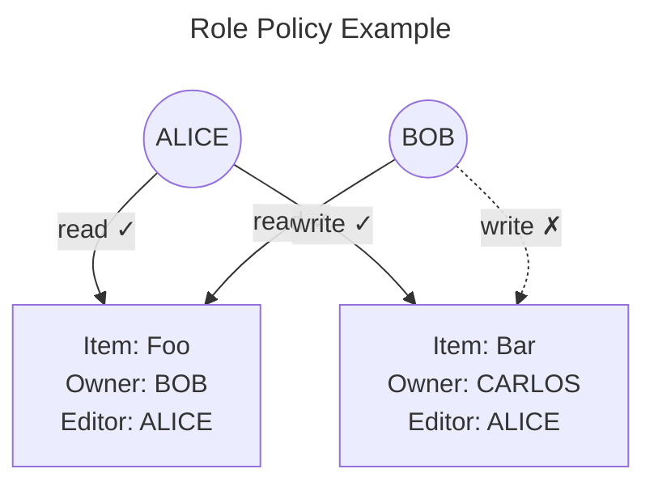

> ## Documentation Index
> Fetch the complete documentation index at: https://www.osohq.com/docs/llms.txt
> Use this file to discover all available pages before exploring further.

# Model Role-Based Access Control (RBAC)

> Best practices for modeling role-based access control in Oso Cloud.

RBAC groups permissions into roles like admin, member, and viewer. Users are assigned to roles instead of individual permissions.



**When to use RBAC:**

* **Organization-level Roles:** RBAC can simplify user management and match real-world organizational hierarchies.
* **Resource-specific Permissions:** Define roles on resources to grant users resource-specific permissions.

## Organization level roles

Use RBAC to simplify user management and match real-world organizational hierarchies.

```polar  theme={null}
# policy.polar
actor User { }

resource Organization {
  roles = ["admin", "member"];
  permissions = [
    "read", "add_member"
  ];

  # organization level permissions
  "read" if "member";
  "add_member" if "admin";

  # role hierarchy:
  # admins inherit all member permissions
  "member" if "admin";
}

test "organization members can read organizations, and admins can add members" {
  setup {
    has_role(User{"alice"}, "member", Organization{"acme"});
    has_role(User{"bob"}, "admin", Organization{"acme"} )
  }

  assert allow(User{"alice"}, "read", Organization{"acme"});
  assert_not allow(User{"alice"}, "add_member", Organization{"acme"});

  assert allow(User{"bob"}, "add_member", Organization{"acme"});
  assert allow(User{"bob"}, "read", Organization{"acme"});
}
```

## Resource-specific roles

Define roles on resources to grant users resource-specific permissions.

```polar  theme={null}
# policy.polar

resource Repository {
  permissions = ["read", "delete"];
  roles = ["member", "admin"];
  relations = {
    organization: Organization,
  };

  # inherit all roles from the organization
  role if role on "organization";

  # admins inherit all repository member permissions
  "member" if "admin";

  "read" if "member";
  "delete" if "admin";
}

test "organization members inherit permissions on repositories belonging to the organization" {
  setup {
    has_role(User{"alice"}, "member", Organization{"acme"});
    has_relation(Repository{"anvil"}, "organization", Organization{"acme"});
    has_relation(Repository{"bar"}, "organization", Organization{"foo"});
  }

  assert allow(User{"alice"}, "read", Organization{"acme"});
  assert allow(User{"alice"}, "read", Repository{"anvil"});

  assert_not allow(User{"alice"}, "delete", Repository{"anvil"});
  assert_not allow(User{"alice"}, "read", Repository{"bar"});
}

test "repository admins can delete repositories, regardless of their organization role" {
  setup {
    has_role(User{"alice"}, "member", Organization{"acme"});
    has_relation(Repository{"anvil"}, "organization", Organization{"acme"});
    has_relation(Repository{"deleteme"}, "organization", Organization{"acme"});
    has_role(User{"alice"}, "admin", Repository{"deleteme"});
  }

  assert_not allow(User{"alice"}, "delete", Repository{"anvil"});
  assert allow(User{"alice"}, "delete", Repository{"deleteme"});
}
```

## Global roles

Use global roles to give users application-wide permissions across all resources. This is common for internal tools and super-admin functionality.

```polar  theme={null}
# policy.polar
actor User { }

global {
  roles = ["admin"];
}

resource Organization {
  roles = ["admin", "member", "internal_admin"];
  permissions = ["read", "write"];

  # internal roles
  "internal_admin" if global "admin";
  "read" if "internal_admin";

  "member" if "admin";

  "read" if "member";
  "write" if "admin";
}

test "global admins can read all organizations" {
  setup {
    has_role(User{"alice"}, "admin");
  }

  assert allow(User{"alice"}, "read", Organization{"acme"});
  assert allow(User{"alice"}, "read", Organization{"foobar"});
}
```

## Resource ownership

Use this pattern to grant additional permissions to resource creators or owners.

```polar  theme={null}
# ...policy.polar
resource Repository {
  roles = ["maintainer"];
}

resource Issue {
  roles = ["reader", "admin"];
  permissions = ["read", "comment", "update", "close"];
  relations = { repository: Repository, creator: User };

  # repository maintainers can administer issues
  "admin" if "maintainer" on "repository";

  "reader" if "admin";
  "reader" if "creator";

  "read" if "reader";
  "comment" if "reader";

  "update" if "creator";
  "close" if "creator";
  "close" if "admin";
}

test "issue creator can update and close issues" {
  setup {
    has_relation(Issue{"537"}, "repository", Repository{"anvil"});
    has_relation(Issue{"42"}, "repository", Repository{"anvil"});
    has_relation(Issue{"537"}, "creator", User{"alice"});
  }

  assert allow(User{"alice"}, "close", Issue{"537"});
  assert allow(User{"alice"}, "update", Issue{"537"});
  assert_not allow(User{"alice"}, "close", Issue{"42"});
}

test "repository maintainers can close issues" {
  setup {
    has_relation(Issue{"537"}, "repository", Repository{"anvil"});
    has_relation(Issue{"42"}, "repository", Repository{"anvil"});
    has_relation(Issue{"537"}, "creator", User{"alice"});
    has_role(User{"bob"}, "maintainer", Repository{"anvil"});
  }
  assert allow(User{"bob"}, "close", Issue{"537"});
  assert_not allow(User{"bob"}, "update", Issue{"537"});
  assert allow(User{"bob"}, "close", Issue{"42"});
}
```

## Additional RBAC patterns

Explore these additional role-based patterns:

| Pattern                                                               | Description                                                             |
| --------------------------------------------------------------------- | ----------------------------------------------------------------------- |
| **[Custom roles](/develop/policies/patterns/custom-roles)**           | Enable users to create their own custom roles                           |
| **[Conditional roles](/develop/policies/patterns/conditional-roles)** | Assign roles based on conditions like default roles and feature toggles |
| **[Resource sharing](/develop/policies/patterns/resource-sharing)**   | Grant additional permissions by inviting other users                    |

## Next steps

After you've defined your RBAC policy:

1. [**Add facts**](/develop/facts/overview): Store user roles and resource relationships in Oso Cloud
2. [**Make authorization requests**](/develop/enforce/authorize-requests): Check permissions in your application code
3. **Test thoroughly**: Verify your policies work with test scenarios and realistic data
