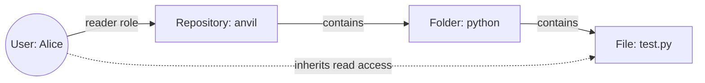

> ## Documentation Index
> Fetch the complete documentation index at: https://www.osohq.com/docs/llms.txt
> Use this file to discover all available pages before exploring further.

# Model Relationship-Based Access Control (ReBAC)

> Best practices for modeling relationship-based access control in Oso Cloud.

The ReBAC pattern organizes permissions based on relationships between resources. For example, granting a user access to a folder automatically grants access to its files.



**When to use ReBAC:** You need to grant permissions on resources based on their relationship to users or other resources.

## Files & folders pattern

The most common ReBAC pattern cascades permissions through nested resources like files in folders, and folders in repositories.

```polar  theme={null}
actor User { }

resource Repository {
  roles = ["reader", "maintainer"];
}

resource Folder {
  roles = ["reader", "writer"];
  relations = {
    repository: Repository,
    folder: Folder,
  };

  "reader" if "reader" on "repository";
  "writer" if "maintainer" on "repository";
  role if role on "folder";
}

resource File {
  permissions = ["read", "write"];
  roles = ["reader", "writer"];
  relations = {
    folder: Folder,
  };

  role if role on "folder";
  "read"  if "reader";
  "write" if "writer";
}

test "folder roles apply to files" {
  setup {
    has_role(User{"alice"}, "reader", Repository{"anvil"});
    has_relation(Folder{"python"}, "repository", Repository{"anvil"});
    has_relation(Folder{"tests"}, "folder", Folder{"python"});
    has_relation(File{"test.py"}, "folder", Folder{"tests"});
  }
  assert allow(User{"alice"}, "read", File{"test.py"});
}
```

**How it works:**

* Repository readers get **reader** role on all folders
* Repository maintainers get **writer** role on all folders
* Users inherit roles recursively through nested folders
* Files inherit roles from their parent folder

## User-resource relationships

Grant special permissions based on relationships between users and resources. In this example, issue creators can update their own issues, but only repository maintainers can close any issue.

```polar  theme={null}
actor User { }

resource Repository {
  roles = ["maintainer"];
}

resource Issue {
  roles = ["reader", "admin"];
  permissions = ["read", "comment", "update", "close"];
  relations = { repository: Repository, creator: User };

  # repository maintainers can administer issues
  "admin" if "maintainer" on "repository";

  "reader" if "admin";
  "reader" if "creator";

  "read" if "reader";
  "comment" if "reader";
  "update" if "creator";
  "close" if "creator";
  "close" if "admin";
}

test "issue creator can update and close issues" {
  setup {
    has_relation(Issue{"537"}, "repository", Repository{"anvil"});
    has_relation(Issue{"42"}, "repository", Repository{"anvil"});
    has_relation(Issue{"537"}, "creator", User{"alice"});
  }
  assert allow(User{"alice"}, "close", Issue{"537"});
  assert allow(User{"alice"}, "update", Issue{"537"});
  assert_not allow(User{"alice"}, "close", Issue{"42"});
}

test "repository maintainers can close issues" {
  setup {
    has_relation(Issue{"537"}, "repository", Repository{"anvil"});
    has_relation(Issue{"42"}, "repository", Repository{"anvil"});
    has_relation(Issue{"537"}, "creator", User{"alice"});
    has_role(User{"bob"}, "maintainer", Repository{"anvil"});
  }
  assert allow(User{"bob"}, "close", Issue{"537"});
  assert_not allow(User{"bob"}, "update", Issue{"537"});
  assert allow(User{"bob"}, "close", Issue{"42"});
}
```

## Bidirectional role inheritance

Sometimes you need roles to flow both ways between resources. Child resources can inherit from parents, and parents can inherit from children.

This pattern requires writing longhand rules instead of using the `relations` feature.

```polar  theme={null}
actor User {}

resource ParentResource {
  roles = ["admin", "member"];
  permissions = ["read", "write"];

  "read" if "member";
  "write" if "admin";
  "member" if "admin";
}

resource ChildResource {
  roles = ["admin", "member"];
  permissions = ["read", "write"];
  relations = { parent: ParentResource };

  "read" if "member";
  "write" if "admin";
  "member" if "admin";

  # ChildResource inherits admin from ParentResource
  "admin" if "admin" on "parent";
}

# ParentResource inherits member from ChildResource
has_role(user: User, "member", parent_resource: ParentResource) if
  child_resource matches ChildResource and
  has_role(user, "member", child_resource) and
  has_relation(child_resource, "parent", parent_resource);

test "inherit role on parent from child" {
  setup {
    has_relation(ChildResource{"anvil"}, "parent", ParentResource{"acme"});
    has_role(User{"alice"}, "member", ChildResource{"anvil"});
  }
  assert allow(User{"alice"}, "read", ParentResource{"acme"});
}
```

## ReBAC patterns

ReBAC patterns solve complex authorization scenarios by modeling real-world relationships.

| Pattern                                                                         | Description                                                         |
| ------------------------------------------------------------------------------- | ------------------------------------------------------------------- |
| [User groups](/develop/policies/patterns/user-groups)                           | Controlling permissions by membership in a group                    |
| [Impersonation](/develop/policies/patterns/impersonation)                       | Allowing one user to inherit a subset of another user's permissions |
| [Organization hierarchies](/develop/policies/patterns/organizational-hierarchy) | Cascading permissions through user relationships                    |

## Next steps

With your ReBAC policy defined:

1. [**Add facts**](/develop/facts/overview): Store resource attributes and user context in Oso Cloud
2. [**Make authorization requests**](/develop/enforce/authorize-requests): Check permissions in your application code
3. **Test scenarios**: Verify policies work with different relationship combinations
